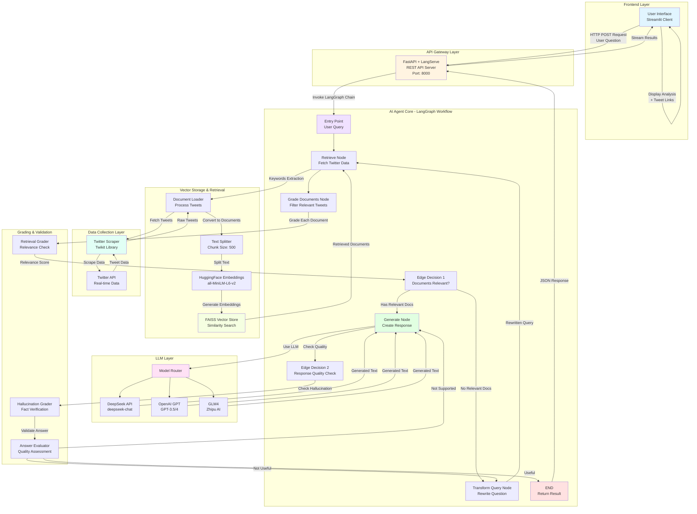

# XAgent: X (Twitter) Hotspots & Public Opinion Real-Time Analysis Agent

## Project Introduction
XAgent is a complex AI Agent application built on large models. This tool receives user input on the web front-end, and the back-end scrapes X (Twitter) data in real time. Based on the user's input, it queries real-time data, autonomously conducts data analysis, and generates precise responses or data analysis reports, which are then returned to the user through the front-end. For example, users can request:
- I am learning about AI trends. Please find the most liked and retweeted posts about AI and return the links along with your recommendations.
- I am preparing to post about the latest tech developments. Please generate a viral tweet based on current trending topics to help me gain more attention.

## Core Technology

**In terms of project architecture**, XAgent is an end-to-end service using a front-end/back-end separation architecture. The backend combines LangServe and FastAPI technologies, utilizing the LangServe's `add_routes` interface to encapsulate chains and RAG services from LangChain into REST APIs. It supports high-concurrency requests, streaming, and asynchronous operations. The frontend is built with Streamlit, focusing on simple user interaction rather than complex visual presentation. **In terms of technology application**, the core AI Agent framework is provided by LangGraph, and the basic model invocation is done through LangChain, supporting the most popular GPT series (international), GLM4 models (domestic), and DeepSeek models.

- **Technology Stack**

  - **AI Agent Framework**: LangGraph

  - **Model Invocation**: Supports mainstream online & open-source models through LangChain (GPT, GLM4, DeepSeek)

  - **Frontend Technology**: Streamlit

  - **Backend Technology**: LangServe + FastAPI

  - **Embedded Models**: OpenAI Embedding, GLM Embedding, DeepSeek Embedding

  - **State Tracking**: LangSmith


- **Complete Project Architecture**



<div align="center">
<i>This diagram shows the complete data flow from user input through Twitter scraping, vector storage, LLM processing, to final response generation</i>
</div>

- **Core Function Development Flowchart**


## Installation Guide

### Quick Start (All Platforms)
```bash
# Clone repository
git clone https://github.com/peige-guo/twitter_trend_agent.git
cd XAgent

# Install dependencies (10-100x faster than pip!)
uv pip install -r requirements.txt

# Install Playwright browsers
playwright install

# Create .env file (or copy from .env.example and edit)
cat > .env << EOF
DEEPSEEK_API_KEY=your_key_here
model=deepseek-chat

# Twitter/X Authentication (REQUIRED for scraping)
TWITTER_USERNAME=your_twitter_username
TWITTER_EMAIL=your_email@example.com
TWITTER_PASSWORD=your_twitter_password
EOF

# Run server (Terminal 1)
python app/server.py

# Run client (Terminal 2 - opens browser automatically)
streamlit run app/client.py
```


